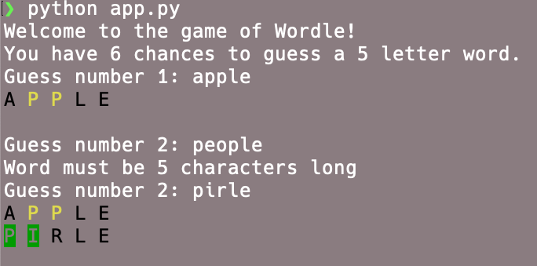
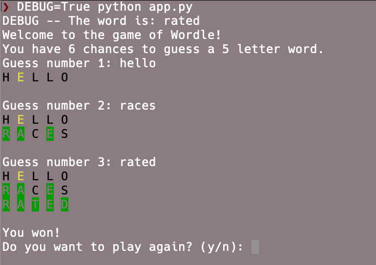

# Wordle Game - Python
A simple version of wordle game written in Python.

## Summary
Guess the Wordle in 6 tries. Each guess must be a valid 5-letter word. The color of the tiles will change to show how close your guess was to the word.

## Prerequisites

You with need Python 3.9 or later installed before you can run the game.

Install [enchant](https://pyenchant.github.io/pyenchant/install.html)

You will also need to install the `requests` module to update the word list but you can skip it if you just want to play only.

## How to play
You can run the Python script to start playing.

```bash
python app.py
```



Run with debug mode to test it.

```bash
DEBUG=True python app.py
```



## Tests
There are a few test cases added for this game. You can run it with:

```bash
python -m unittest
```

## TODOs

This is a minimal version of the game, there are a few of cases need to be covered as well as many cool features can be added such as:

- Verify the valid word from user's input.
- Configuration to play with different settings of guess word (6-7 letters) and number of guesses.
- a UI version with Tkinter.

## Updates

- Added [Enchant](https://pyenchant.github.io/pyenchant/index.html) module to check valid English word.
- Show the right word after user loses.
